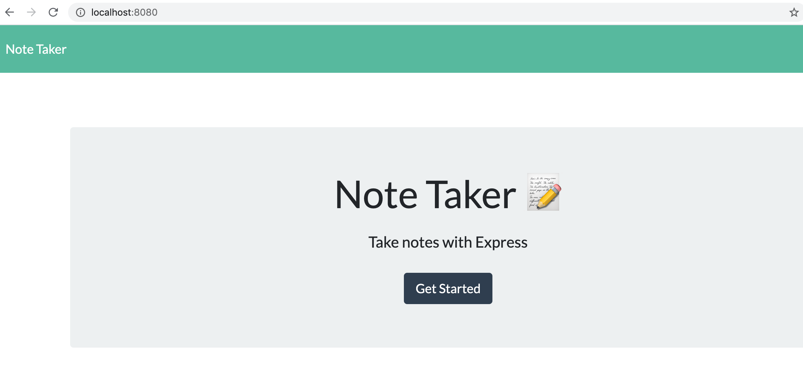
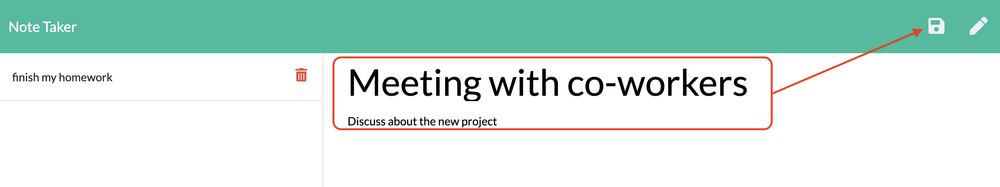

# Note_Taker

## Table of Contents:
  - [Description](#description)
  - [Installation](#installation)
  - [Run](#run)
  - [Deploy in Heroku](#deploy)
  - [Question](#question) 

## Description 
Application that can be used to write, save, and delete notes.

`Home page`


`Note page`


`Save new note` 


`Application presentation video`


## Installation 
```
npm install
package.json
```

## Run
- Terminal : `node server.js`
- Browser : `localhost:8080/`

<a name="deploy"></a>

## Deploy in Heroku 
- [Heroku_link](https://note-taker-adriana.herokuapp.com)

##  Question 
  For more questions about Team Profile Generator you can go to my Github page at the follow link: 

  - [GitHub Profile](https://github.com/adriana-carmo)
  - [GitHub Repo](https://github.com/adriana-carmo/Note_Taker)

  For additional questions please reach out to my e-mail at : dri.abedala@gmail.com
